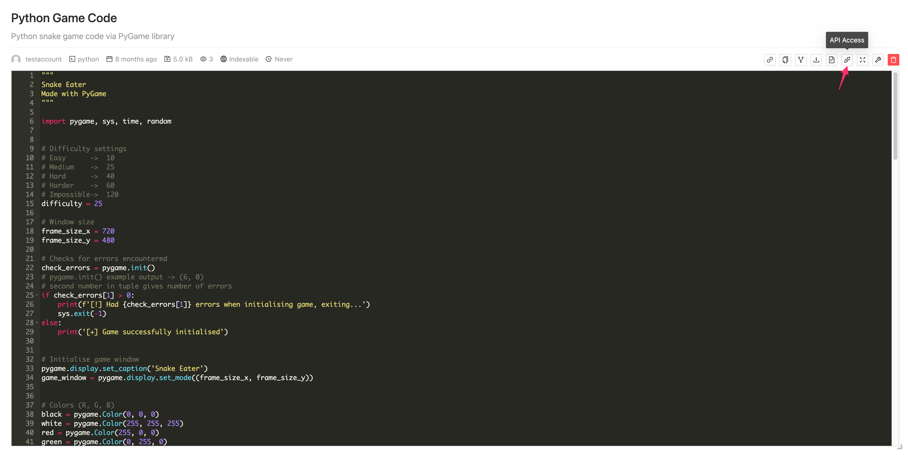

# Using an API Key

Currently, we have limited use cases, but we will soon integrate API keys into more services.

## Programmatic Access to Snippets

**This feature was previously open to the public, allowing anyone to use it. Unfortunately, some individuals abused it, which negatively impacted our domain's reputation. As a result, this feature is now available only upon request. Please contact us with a legitimate use case to gain programmatic access to snippets.**

You can access and directly download all your private snippets and other public snippets using your API key. 

Click on `API Access` on any snippet detail page to view the instructions.

   

As an example, here is the format of the API URL:

   ```
   https://api.pastecode.io/anon/raw-snippet/SNIPPET_ID?raw=inline&api=true&ticket=API_KEY&password=SNIPPET_PASSWORD_IF_NEEDED
   ```

   Replace the following placeholders in the URL:
   - `SNIPPET_ID` with the actual ID of your snippet.
   - `API_KEY` with your actual API key.
   - If you want to download the snippet directly, replace `raw=inline` query parameter with `raw=attachment`.
   - Replace `SNIPPET_PASSWORD_IF_NEEDED` with your actual snippet password if the snippet is password protected.

## Login via API Key

If you enable the `Allow Login` option during API key creation, you can use your API key for login. For example, our Visual Studio Code extension requires a login-enabled API key to access your account.

### Warnings

Please take note of the following important information regarding API keys:

- API keys can be used for logging in and accessing raw snippet contents. This means that both your private snippets and publicly accessible snippets from other users can be accessed using your API key.

- API keys function similarly to passwords. If you enable login functionality with your API key, it will be used to obtain a JSON Web Token (JWT) and will bypass two-factor authentication (2FA). This can potentially put your account at risk if the API key falls into the wrong hands.

- Deactivating an API key does not automatically log you out from any active sessions you may have logged into using that key. However, the same API key cannot be used again to obtain a new JWT. To log out, you will need to do it manually or wait until the JWT expires and the session terminates.

- It is crucial to keep your API keys secure and avoid enabling login functionality unnecessarily. Exercise caution when using API keys with unofficial clients and refrain from sharing them with others.

Please ensure the safety of your API keys and use them responsibly to protect the integrity of your account.
